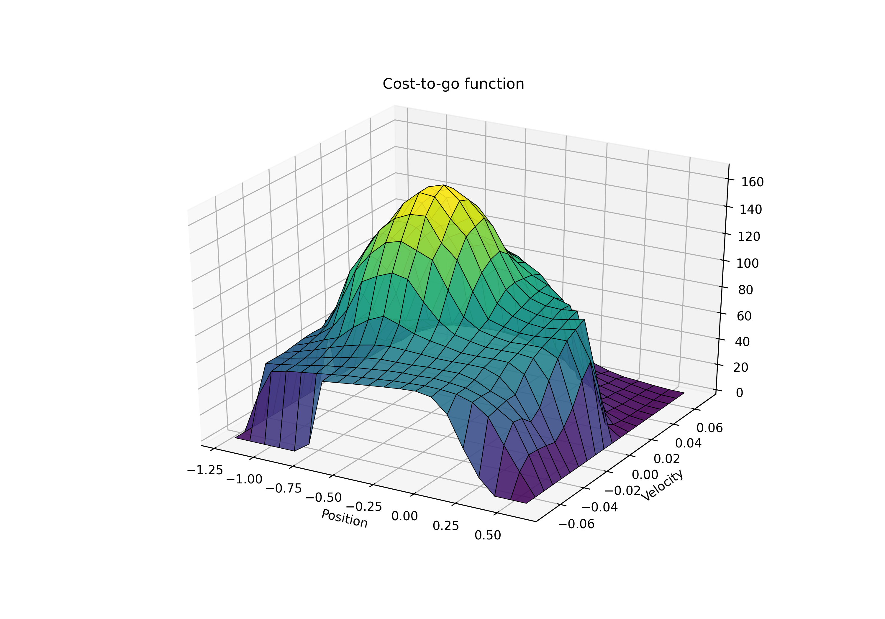

# Mountain car example for reinforcement learning

Reproduction of mountain car example by Sutton and Barto (1998) using reinforcement learning.  


The figure below is a reproduction of the cost-to-go function from the mountain car example of Sutton and Barto ([this book](https://drive.google.com/file/d/1opPSz5AZ_kVa1uWOdOiveNiBFiEOHjkG/view).  


**Prerequisites**


This script was written using Python3.6 and the Python modules described in [requirements.txt](requirements.txt).  It is recommended to use a virtual environment when running this example.  A virtual environment can be created and activated using `venv` in the following manner:

```bash
python3 -m venv venv
source venv/bin/activate

pip install -r requirements.txt
```


**Usage**


The mountain car example can then be run (after activating the virtual environment) using: 

```bash
python mountain_car.py
```


